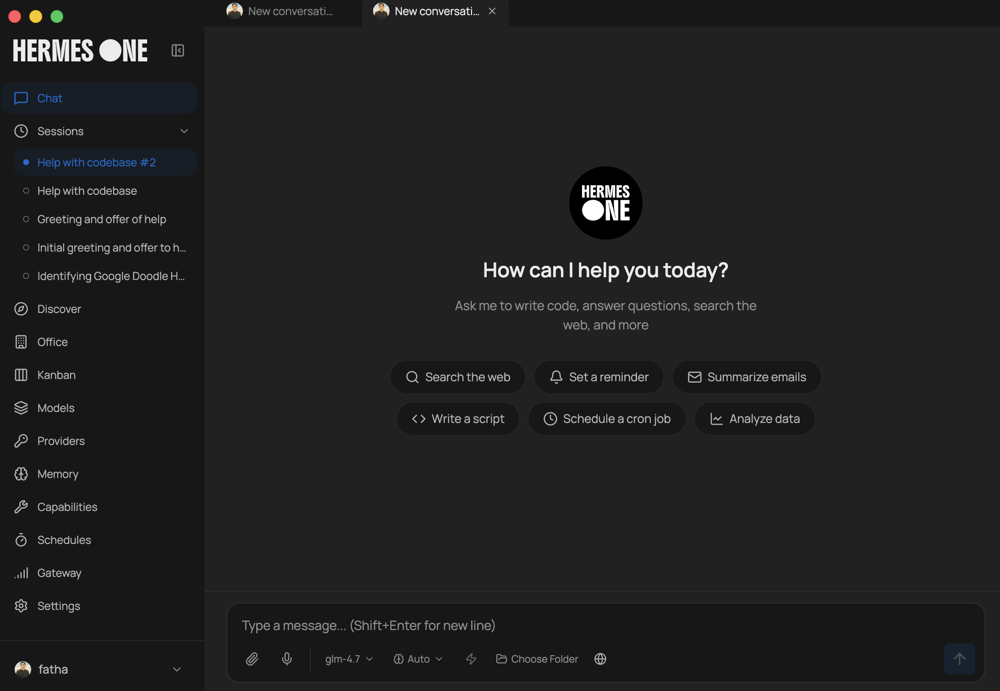
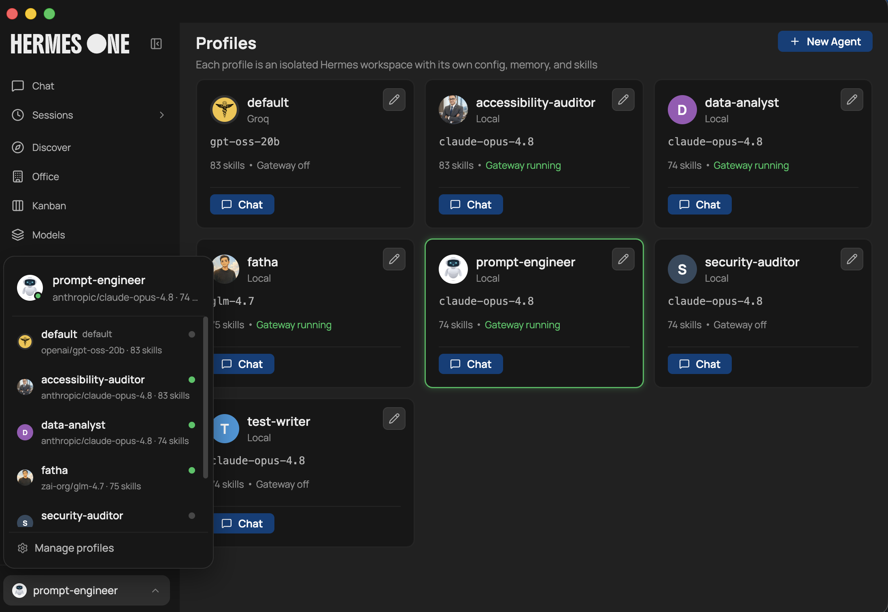
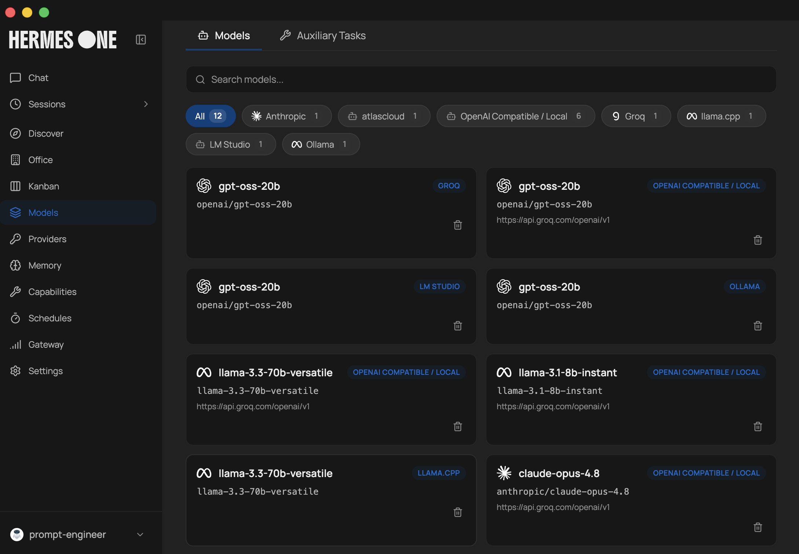
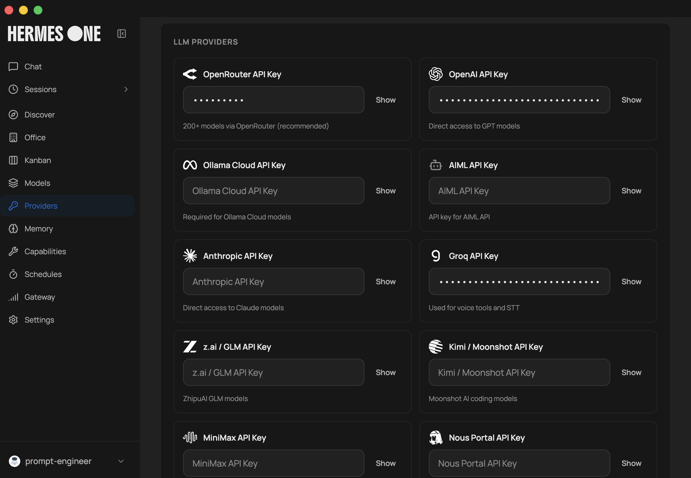
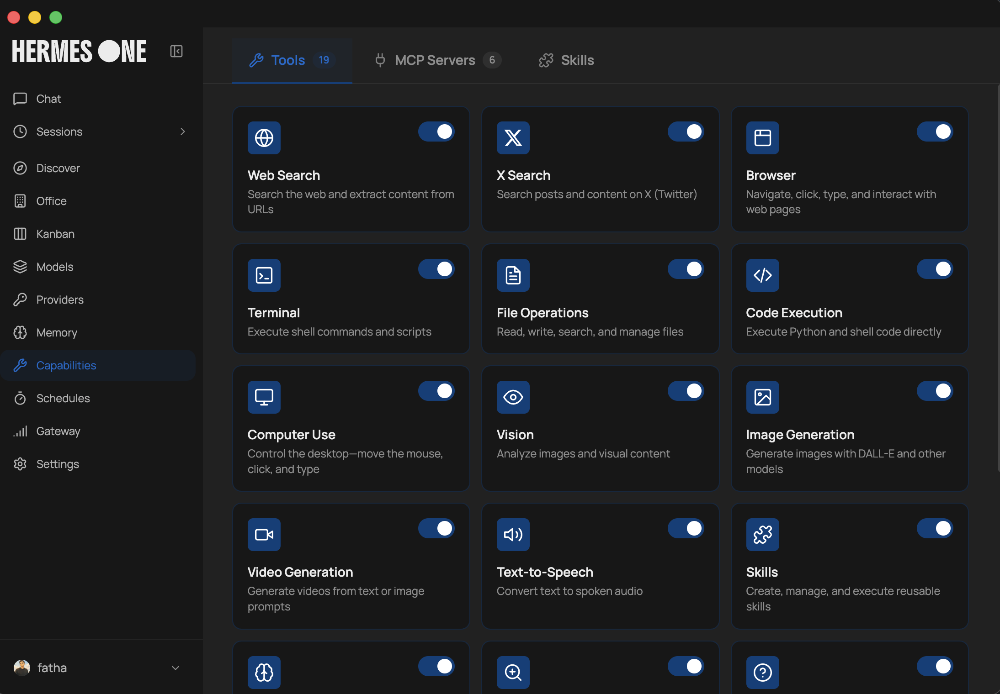
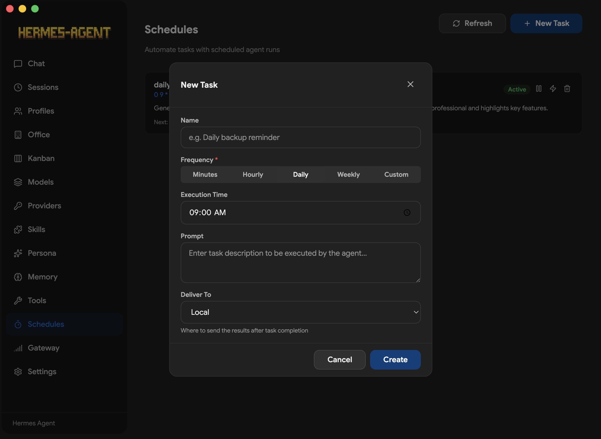
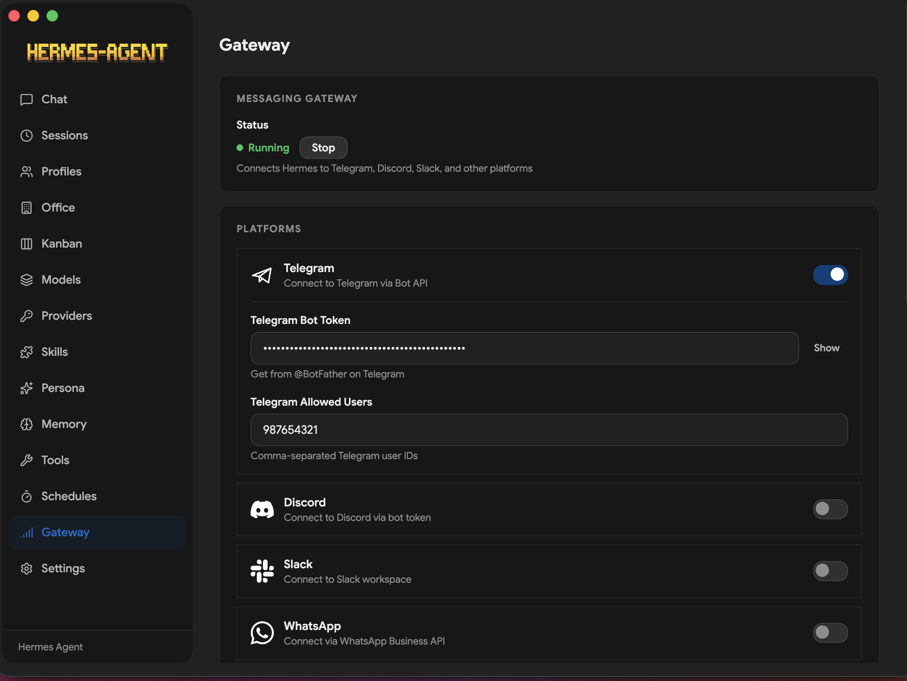
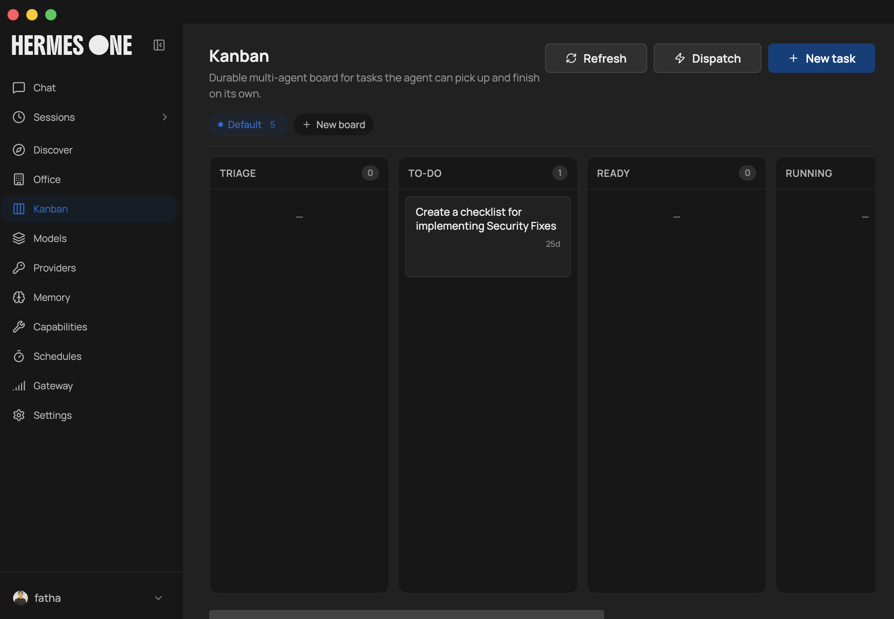
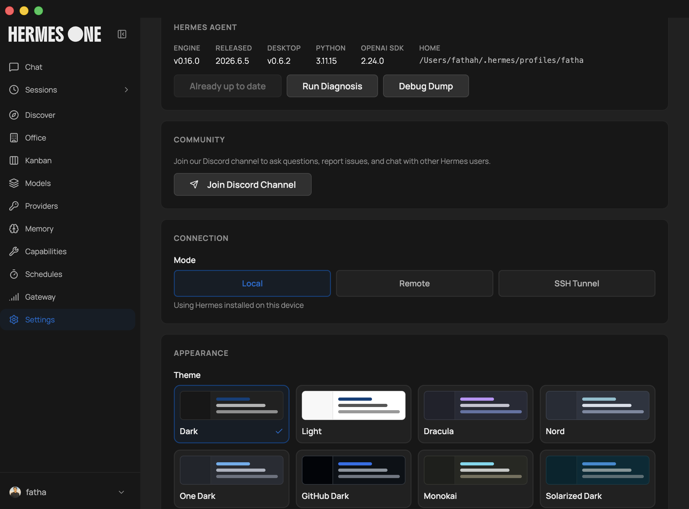

<br/>
<p align="center">
  <a href="https://hermes-agent.nousresearch.com/docs/"></a>
  <a href="https://t.me/hermes_agent_desktop"></a>
  <a href="https://github.com/fathah/hermes-desktop/blob/main/LICENSE"></a>
  <a href="https://hermesagents.cc/"></a>
<a href="https://github.com/fathah/hermes-desktop/stargazers">
  
</a>
  <a href="https://github.com/fathah/hermes-desktop/releases/">
  
</a>
</p>

> **이 프로젝트는 활발히 개발 중입니다.** 기능이 변경되거나 일부 기능이 중단될 수 있습니다. 문제가 발생하거나 아이디어가 있다면 [이슈를 열어주세요](https://github.com/fathah/hermes-desktop/issues). 기여를 환영합니다!

## 언어

- English: `README.md`
- 한국어: `README-KO.md`
- 简体中文: `README.zh-CN.md`
- 日本語: `README.ja-JP.md`
- 🌎 Español (LATAM): `README.es-LATAM.md`

Hermes Desktop은 [Hermes Agent](https://github.com/NousResearch/hermes-agent)를 설치, 구성 및 채팅하기 위한 네이티브 데스크톱 앱입니다. 도구 사용, 멀티 플랫폼 메시징 및 폐쇄 학습 루프를 갖춘 자기 개선형 AI 비서입니다.

CLI를 직접 관리하는 대신, 이 앱은 설치, 공급자 설정 및 일상적인 사용을 한 곳에서 진행합니다. 공식 Hermes 설치 스크립트를 사용하며, Hermes를 `~/.hermes`에 저장하고 채팅, 세션, 프로필, 메모리, 스킬, 도구, 일정, 메시징 게이트웨이 등에 대한 GUI를 제공합니다.

## 설치

<a href="https://hermesagents.cc/"></a>

### Windows

> **Windows 사용자:** 인스톨러에 코드 서명이 없습니다. Windows SmartScreen이 첫 실행 시 경고할 수 있습니다 — "자세히 보기" → "어쨌든 실행"을 클릭하세요.

> **WSL 사용자:** 인스톨러가 `루트 사용자로 전환하여 종속성 설치 중...`에서 멈추면, Playwright가 TTY가 없는 sudo 비밀번호를 기다리고 있습니다. 설치를 위해 비밀번호 없는 sudo를 부여한 후 완료 후 되돌리세요:
>
> ```bash
> echo "$USER ALL=(ALL) NOPASSWD: ALL" | sudo tee /etc/sudoers.d/hermes-install
> # …인스톨러 재실행; 완료 후:
> sudo rm /etc/sudoers.d/hermes-install
> ```
>
> [#109](https://github.com/fathah/hermes-desktop/issues/109)에서 추적 중.

### Fedora (RPM)

```bash
sudo dnf install ./hermes-desktop-<version>.rpm
```

> **Fedora 사용자:** `.rpm`은 GPG 서명되지 않았습니다. 시스템에서 서명 검사를 강제하는 경우, 설치 명령에 `--nogpgcheck`를 추가하세요. `.rpm` 빌드에는 자동 업데이트가 지원되지 않습니다 (`electron-updater`의 제한 사항); 새 `.rpm`을 재설치하여 업데이트하세요.

## 미리보기

<table>
<tr>
<td width="50%" align="center"><b>채팅</b><br/></td>
<td width="50%" align="center"><b>프로필</b><br/></td>
</tr>
<tr>
<td width="50%" align="center"><b>모델</b><br/></td>
<td width="50%" align="center"><b>공급자</b><br/></td>
</tr>
<tr>
<td width="50%" align="center"><b>도구</b><br/></td>
<td width="50%" align="center"><b>스킬</b><br/></td>
</tr>
<tr>
<td width="50%" align="center"><b>일정</b><br/></td>
<td width="50%" align="center"><b>게이트웨이</b><br/></td>
</tr>
<tr>
<td width="50%" align="center"><b>페르소나</b><br/></td>
<td width="50%" align="center"><b>칸반</b><br/></td>
</tr>
<tr>
<td width="50%" align="center"><b>오피스</b><br/></td>
<td width="50%" align="center"><b>설정</b><br/></td>
</tr>
</table>

## 주요 기능

- **안내형 첫 실행 설치** — Hermes Agent를 위한 진행률 추적 및 종속성 해결
- **로컬 또는 원격 백엔드** — `127.0.0.1:8642`에서 Hermes를 로컬로 실행하거나 URL + API 키로 원격 Hermes API 서버에 데스크톱 앱 연결
- **다중 공급자 지원** — OpenRouter, Anthropic, OpenAI, Google (Gemini), xAI (Grok), Nous Portal, Qwen, MiniMax, Hugging Face, Groq 및 로컬 OpenAI 호환 엔드포인트 (LM Studio, Atomic Chat, Ollama, vLLM, llama.cpp)
- **스트리밍 채팅 UI** — SSE 스트리밍, 도구 진행률 표시, Markdown 렌더링 및 구문 강조
- **토큰 사용량 추적** — 채팅 하단에서 실시간 프롬프트/완성 토큰 수 및 비용 표시, `/usage` 슬래시 명령어 지원
- **22개 슬래시 명령어** — `/new`, `/clear`, `/fast`, `/web`, `/image`, `/browse`, `/code`, `/shell`, `/usage`, `/help`, `/tools`, `/skills`, `/model`, `/memory`, `/persona`, `/version`, `/compact`, `/compress`, `/undo`, `/retry`, `/debug`, `/status` 등
- **세션 관리** — 전체 텍스트 검색 (SQLite FTS5), 날짜 그룹화 기록, 대화 간_resume 및 검색_
- **프로필 전환** — 별도의 Hermes 환경 간 생성, 삭제 및 전환 (격리된 구성)
- **14개 도구셋** — 웹, 브라우저, 터미널, 파일, 코드 실행, 비전, 이미지 생성, TTS, 스킬, 메모리, 세션 검색, 확인 질문, 위임, MoA, 작업 계획
- **메모리 시스템** — 메모리 항목 보기/편집, 사용자 프로필 메모리, 용량 추적 및 메모리 공급자 탐색 (Honcho, Hindsight, Mem0, RetainDB, Supermemory, ByteRover)
- **페르소나 편집기** — 에이전트의 SOUL.md 페르소나 편집 및 재설정
- **저장된 모델** — 공급자 간 모델 구성 CRUD 관리
- **예약된 작업** — cron 작업 빌더 (분, 시간별, 일일, 주간, 사용자 지정 cron) + 15개 전달 대상
- **16개 메시징 게이트웨이** — Telegram, Discord, Slack, WhatsApp, Signal, Matrix, Mattermost, 이메일 (IMAP/SMTP), SMS (Twilio/Vonage), iMessage (BlueBubbles), DingTalk, Feishu/Lark, WeCom, WeChat (iLink Bot), 웹훅, Home Assistant
- **Hermes Office (Claw3d)** — 개발 서버 및 어댑터 관리가 포함된 시각적 3D 인터페이스
- **백업, 가져오기 & 디버그 덤프** — Settings에서 전체 데이터 백업/복구 및 시스템 진단
- **로그 뷰어** — Settings 화면에서 직접 게이트웨이 및 에이전트 로그 보기
- **자동 업데이트** — electron-updater를 통한 업데이트 확인 및 설치
- **i18n 지원** — 모든 화면을 커버하는 영어 로케일 포함 국제화 프레임워크, 커뮤니티 번역 준비 완료
- **테스트 스위트** — SSE 파서, IPC 핸들러, preload API 표면, 인스톨러 유틸리티 및 상수 검증 (Vitest)

## 동작 방식

첫 실행 시 앱은 다음을 진행합니다:

1. Hermes를 **로컬**로 실행할지 **원격** Hermes API 서버에 연결할지 묻습니다.
2. **로컬 모드:** `~/.hermes`에 Hermes가 이미 설치되어 있는지 확인합니다. 없으면 공식 Hermes 인스톨러를 종속성 해결 (Git, uv, Python 3.11+) 과 함께 실행합니다.
3. **원격 모드:** 원격 API URL과 API 키를 입력하도록 요청하고, 연결을 검증한 후 로컬 설치를 건너뜁니다.
4. API 공급자 또는 로컬 모델 엔드포인트를 입력하도록 요청합니다.
5. Hermes 구성 파일을 통해 공급자 구성 및 API 키를 저장합니다.
6. 설정이 완료되면 메인 작업 공간을 시작합니다.

로컬 모드에서는 채팅 요청이 `http://127.0.0.1:8642`를 통해 SSE 스트리밍으로 전달됩니다. 원격 모드에서는 앱이 동일한 스트리밍 프로토콜로 구성된 원격 URL과 통신합니다. 데스크톱 앱은 스트림을 실시간으로 파싱하여 도구 진행률, Markdown 콘텐츠 및 토큰 사용량을 표시합니다.

## 화면

| 화면         | 설명                                                                           |
| ------------- | ------------------------------------------------------------------------------------- |
| **채팅**      | 슬래시 명령어, 도구 진행률, 토큰 추적이 포함된 스트리밍 대화 UI                      |
| **세션**      | 과거 대화 탐색, 검색 및 재개                                                         |
| **프로필**    | Hermes 프로필 생성, 삭제 및 전환                                                     |
| **스킬**      | 번들 및 설치된 스킬 탐색, 설치 및 관리                                               |
| **모델**      | 공급자별 저장된 모델 구성 관리                                                       |
| **메모리**    | 메모리 항목 보기/편집, 사용자 프로필 및 메모리 공급자 구성                            |
| **페르소나**  | 활성 프로필의 페르소나 (SOUL.md) 편집                                                |
| **도구**      | 개별 도구셋 활성화 또는 비활성화                                                     |
| **일정**      | 전달 대상과 함께 cron 작업 생성 및 관리                                              |
| **게이트웨이**| 메시징 플랫폼 통합 구성 및 제어                                                      |
| **오피스**    | Claw3d 시각적 인터페이스 설정 및 관리                                                |
| **설정**      | 공급자 구성, 인증 풀, 백업/가져오기, 로그 뷰어, 네트워크 설정, 테마                   |

## 지원 공급자

### LLM 공급자

| 공급자            | 설명                                    |
| ------------------- | ---------------------------------------- |
| **OpenRouter**      | 단일 API를 통한 200+ 모델 (권장)         |
| **Anthropic**       | Claude 직접 접근                         |
| **OpenAI**          | GPT 직접 접근                            |
| **Google (Gemini)** | Google AI Studio                         |
| **xAI (Grok)**      | Grok 모델                                |
| **Nous Portal**     | 무료 티어 제공                           |
| **Qwen**            | QwenAI 모델                              |
| **MiniMax**         | 글로벌 및 중국 엔드포인트                |
| **Hugging Face**    | HF Inference를 통한 20+ 오픈 모델        |
| **Groq**            | 고속 추론 (음성/STT)                     |
| **로컬/사용자 지정**| 모든 OpenAI 호환 엔드포인트              |

LM Studio, Atomic Chat, Ollama, vLLM, llama.cpp를 위한 로컬 프리셋이 포함되어 있습니다.

### 메시징 플랫폼

Telegram, Discord, Slack, WhatsApp, Signal, Matrix/Element, Mattermost, 이메일 (IMAP/SMTP), SMS (Twilio & Vonage), iMessage (BlueBubbles), DingTalk, Feishu/Lark, WeCom, WeChat (iLink Bot), 웹훅, Home Assistant.

### 도구 통합

Exa Search, Parallel API, Tavily, Firecrawl, FAL.ai (이미지 생성), Honcho, Browserbase, Weights & Biases, Tinker.

## 개발

### 필수 요구사항

- Node.js 및 npm
- Hermes 인스톨러를 위한 유닉스 계열 셸 환경
- 첫 실행 설치 중 Hermes 다운로드를 위한 네트워크 액세스

### 종속성 설치

```bash
npm install
```

### 개발 모드에서 앱 시작

```bash
npm run dev
```

### 체크 실행

```bash
npm run lint
npm run typecheck
```

### 테스트 실행

```bash
npm run test
npm run test:watch
```

### 데스크톱 앱 빌드

```bash
npm run build
```

플랫폼 패키지:

```bash
npm run build:mac
npm run build:win
npm run build:linux
npm run build:rpm    # Fedora/RHEL .rpm 전용
```

## 처음 설정

앱을 처음 열면 기존 Hermes 설치를 감지하거나 설치를 제공します.

UI에서 지원되는 설정 경로:

- `OpenRouter`
- `Anthropic`
- `OpenAI`
- `로컬 LLM` — OpenAI 호환 기본 URL을 통한 연결

로컬 프리셋:

- LM Studio
- Atomic Chat
- Ollama
- vLLM
- llama.cpp

Hermes 파일 관리 위치:

- `~/.hermes`
- `~/.hermes/.env`
- `~/.hermes/config.yaml`
- `~/.hermes/hermes-agent`
- `~/.hermes/profiles/` — 이름별 프로필 디렉토리
- `~/.hermes/state.db` — 세션 기록 데이터베이스
- `~/.hermes/cron/jobs.json` — 예약된 작업

## 기술 스택

- **Electron** 39 — 크로스 플랫폼 데스크톱 셸
- **React** 19 — UI 프레임워크
- **TypeScript** 5.9 — 메인 및 렌더러 프로세스 간 타입 안전성
- **Tailwind CSS** 4 — 유틸리티 퍼스트 스타일링
- **Vite** 7 + electron-vite — 빠른 개발 서버 및 빌드 도구
- **better-sqlite3** — FTS5 전체 텍스트 로컬 세션 저장소
- **i18next** — 국제화 프레임워크
- **Vitest** — 테스트 러너

## 참고

- 데스크톱 앱은 에이전트 동작 및 도구 실행을 위해 업스트림 Hermes Agent 프로젝트에 의존합니다.
- 내장 인스톨러는 `--skip-setup` 옵션으로 공식 Hermes 설치 스크립트를 실행한 후 GUI에서 공급자 구성을 완료합니다.
- 로컬 모델 공급자는 API 키가 필요하지 않지만, 호환 서버가 이미 실행 중이어야 합니다.
- 제한된 네트워크 환경에서는 대체 npm 레지스트리 라우트가 지원됩니다.

## 기여

기여를 환영합니다! [기여 가이드](CONTRIBUTING.md)를 확인하고 시작하세요. 어디서부터 시작해야 할지 모르겠다면 [열린 이슈](https://github.com/fathah/hermes-desktop/issues)를 확인하세요. 버그를 발견했거나 기능 요청이 있다면? [이슈를 작성하세요](https://github.com/fathah/hermes-desktop/issues/new).

## 관련 프로젝트

핵심 에이전트, 문서 및 CLI 워크플로우의 경우 메인 Hermes Agent 저장소를 확인하세요:

- https://github.com/NousResearch/hermes-agent
