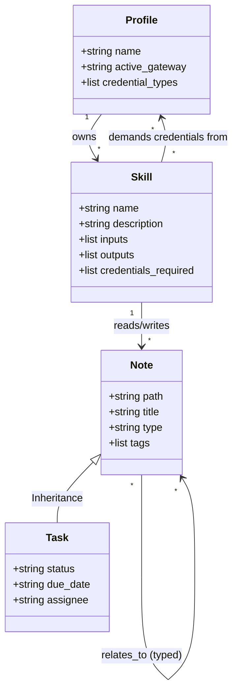

# Hermes Pragmatic Ontology Specification

This document specifies a **Pragmatic Ontology** for the Hermes ecosystem, covering both the **Hermes CLI (`~/.hermes/`)** and the **Hermes Desktop (SPS Agent)**. 

Rather than adopting heavy Semantic Web standards (like RDF/OWL), this specification establishes a lightweight, developer-friendly schema-based knowledge model using **JSON Schema** for CLI assets, **Markdown Frontmatter** for the desktop workspace, and **SQL Table Extensions** for the local SQLite index.

---

## 1. Conceptual Architecture (Pedagogy)

The Hermes Ontology organizes the system into a **Property Graph** consisting of **Entities (Nodes)**, **Attributes (Properties)**, and **Relations (Edges)**. 



### Core Entities
1. **Profile**: A user context containing configurations, active models, and credentials.
2. **Skill**: An executable action (CLI tool or Python subprocess) that performs a specific utility.
3. **Note (Page)**: A raw file in the markdown database.
4. **Task (Subclass of Note)**: A note representing an action item with status, dates, and executors.

---

## 2. CLI Skill Manifest Specification (`manifest.json`)

To enable the agent to dynamically discover, validate, and chain skills, every skill directory in `~/.hermes/skills/<category>/<skill_name>/` should declare a `manifest.json` file.

### A. JSON Schema for Skill Manifests
```json
{
  "$schema": "https://json-schema.org/draft/2020-12/schema",
  "title": "HermesSkillManifest",
  "type": "object",
  "required": ["name", "description", "category", "input", "output"],
  "properties": {
    "name": {
      "type": "string",
      "pattern": "^[a-z0-9-]+$",
      "description": "Kebab-case unique identifier for the skill."
    },
    "displayName": {
      "type": "string",
      "description": "Human-readable name for the UI."
    },
    "description": {
      "type": "string",
      "description": "Clear explanation of what the skill does and when the agent should invoke it."
    },
    "category": {
      "type": "string",
      "enum": ["communication", "productivity", "system", "development", "multimedia", "custom"],
      "description": "High-level classification group."
    },
    "credentials": {
      "type": "array",
      "items": { "type": "string" },
      "description": "Environment variables or config keys required for execution (e.g., GMAIL_TOKEN)."
    },
    "input": {
      "type": "object",
      "required": ["type"],
      "properties": {
        "type": {
          "type": "string",
          "enum": ["null", "string", "array", "object"],
          "description": "The primitive format of the input."
        },
        "schema": {
          "type": "object",
          "description": "Valid JSON Schema defining parameter properties if the input type is an object."
        }
      }
    },
    "output": {
      "type": "object",
      "required": ["type"],
      "properties": {
        "type": {
          "type": "string",
          "enum": ["null", "string", "array", "object"],
          "description": "The primitive format of the output."
        },
        "schema": {
          "type": "object",
          "description": "Valid JSON Schema defining return value fields if the output type is an object."
        }
      }
    }
  }
}
```

### B. Concrete Example: Gmail Skill Manifest
Located at `~/.hermes/skills/communication/gmail/manifest.json`:
```json
{
  "name": "gmail-send-email",
  "displayName": "Send Gmail Email",
  "description": "Sends an email to a recipient via the Gmail API.",
  "category": "communication",
  "credentials": ["GMAIL_OAUTH_TOKEN"],
  "input": {
    "type": "object",
    "schema": {
      "type": "object",
      "required": ["to", "subject", "body"],
      "properties": {
        "to": { "type": "string", "format": "email" },
        "subject": { "type": "string" },
        "body": { "type": "string" }
      }
    }
  },
  "output": {
    "type": "object",
    "schema": {
      "type": "object",
      "required": ["messageId", "status"],
      "properties": {
        "messageId": { "type": "string" },
        "status": { "type": "string" }
      }
    }
  }
}
```

---

## 3. SPS Agent Note Frontmatter Specification

SPS Agent stores documents as Markdown files. We extend the frontmatter schema to classify the page type and specify typed relationships to other pages.

### A. Core Page Types (`type` field)
- `concept`: A mental model, definition, or educational topic (e.g., *Tritone Substitution*).
- `task`: An actionable item containing workflow metadata.
- `project`: A collection of related tasks and reference materials.
- `decision`: An architectural or project design decision block.
- `reference`: An index of static documentation, APIs, or files.

### B. Document Schema Examples

#### Example 1: A Project Page (`project`)
Saved in `vault/hermes-desktop-release.md`:
```markdown
---
title: "Hermes Desktop v1.0 Release"
type: "project"
tags: ["release", "milestone"]
status: "active"
priority: "high"
relations:
  - type: "has_subtask"
    target: "vault/tasks/implement-manifest-loader.md"
  - type: "has_subtask"
    target: "vault/tasks/design-ontology-migration.md"
  - type: "references"
    target: "vault/docs/ontology-spec.md"
---

# Hermes Desktop v1.0 Release

We are tracking the integration of the pragmatic ontology for the v1.0 release.
```

#### Example 2: A Task Page (`task`)
Saved in `vault/tasks/implement-manifest-loader.md`:
```markdown
---
title: "Implement CLI Skill Manifest Loader"
type: "task"
tags: ["development", "cli"]
status: "todo"
due_date: "2026-06-15"
assignee: "Louis"
relations:
  - type: "blocked_by"
    target: "vault/docs/ontology-spec.md"
---

# Implement CLI Skill Manifest Loader

We need to add a parser to `src/main/skills.ts` that reads `manifest.json` files from active skill directories.
```

---

## 4. SQLite Database Index Extensions

The note index (`.note-index.db`) manages links, files, and FTS search. Currently, the `links` table is simple:
```sql
CREATE TABLE IF NOT EXISTS links (
  source TEXT NOT NULL,
  target_norm TEXT NOT NULL
);
```

We extend this schema to add **semantically typed edges** and index frontmatter types cleanly for fast query interfaces.

### A. Extended Table Specifications

```sql
-- Represents typed edges in our local Knowledge Graph
CREATE TABLE IF NOT EXISTS semantic_relations (
  source TEXT NOT NULL,
  target_norm TEXT NOT NULL,
  relation_type TEXT NOT NULL,
  PRIMARY KEY (source, target_norm, relation_type),
  FOREIGN KEY (source) REFERENCES notes(path) ON DELETE CASCADE
);

CREATE INDEX IF NOT EXISTS idx_semantic_source ON semantic_relations(source);
CREATE INDEX IF NOT EXISTS idx_semantic_target ON semantic_relations(target_norm);
CREATE INDEX IF NOT EXISTS idx_semantic_type ON semantic_relations(relation_type);
```

---

## 5. Main Process Extractor Code Draft (`src/main/note-index.ts`)

To populate the schema, the parser inside `NoteIndex` should inspect frontmatter properties. Here is how the node parser integrates:

```typescript
// Draft extension for note-index.ts parsing flow
interface SemanticRelation {
  type: string;
  target: string;
}

function extractSemanticRelations(props: Record<string, unknown>): SemanticRelation[] {
  const relations: SemanticRelation[] = [];
  if (Array.isArray(props.relations)) {
    for (const rel of props.relations) {
      if (
        rel &&
        typeof rel === "object" &&
        typeof rel.type === "string" &&
        typeof rel.target === "string"
      ) {
        relations.push({
          type: rel.type.trim().toLowerCase(),
          target: rel.target.trim()
        });
      }
    }
  }
  return relations;
}

// Inside the db.transaction block in NoteIndex.upsert(relPath, raw, mtime):
// -------------------------------------------------------------------------
// 1. Delete old relations for this source
// this.db.prepare(`DELETE FROM semantic_relations WHERE source = ?`).run(relPath);
//
// 2. Insert new typed relations
// const insSemantic = this.db.prepare(
//   `INSERT OR IGNORE INTO semantic_relations(source, target_norm, relation_type) VALUES(?,?,?)`
// );
// const sRelations = extractSemanticRelations(props);
// for (const rel of sRelations) {
//   insSemantic.run(relPath, normalizeName(rel.target), rel.type);
// }
```

---

## 6. Real-World Execution Scenario (AI Reasoning Loop)

Using this ontology, the AI agent can parse natural language queries into semantic database lookups.

### Query
> "Show me all high-priority project releases that are blocked by another document."

### AI Resolution Path
1. **Identify Node Constraints**: Look for files in `.note-index.db` where `type = 'project'` and `json_extract(props, '$.priority') = 'high'`.
2. **Follow Edge Traversal**: Query `semantic_relations` where `relation_type = 'blocked_by'`.
3. **Assemble Results**: Join results to yield the project name, the task name, and the specific blocking page.

```sql
SELECT 
  n1.title AS project_title,
  n2.title AS blocked_by_title
FROM notes n1
JOIN semantic_relations r ON n1.path = r.source
JOIN notes n2 ON r.target_norm = n2.path -- simplified name resolution
WHERE json_extract(n1.props, '$.type') = 'project'
  AND json_extract(n1.props, '$.priority') = 'high'
  AND r.relation_type = 'blocked_by';
```

---

## 7. Migration & Rollout Plan

1. **Phase 1 (Documentation & CLI Auditing)**: Roll out `manifest.json` templates to the standard active skills in `~/.hermes/skills/` (such as the Gmail, filesystem, and internet research tools).
2. **Phase 2 (Database Updates)**: Deploy the SQLite migration schema inside `src/main/note-index.ts` to add the `semantic_relations` table.
3. **Phase 3 (Editor Enhancements)**: Modify the SPS Agent editor component (`src/renderer/src/screens/SpsAgent/editor/`) to support visual relationship linkers when typing (e.g., autocomplete for relations).
