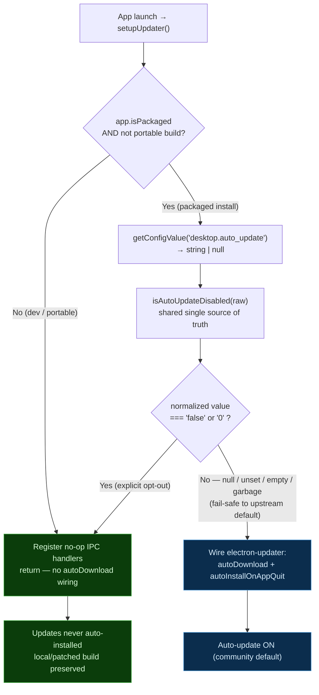
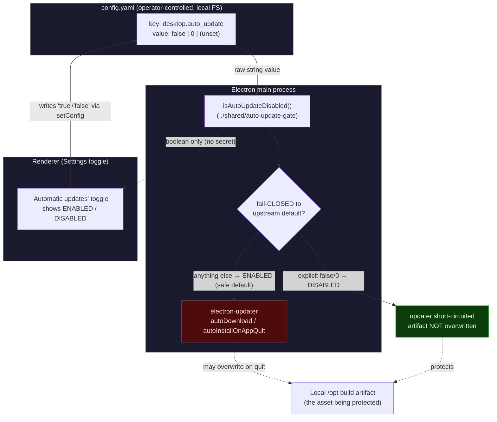

# Auto-update opt-out gate — diagrams

Diagrams for the `desktop.auto_update` opt-out feature (branch `secrets/04`).
Auto-update is **ENABLED BY DEFAULT**; only an explicit `desktop.auto_update: false`
(or `0`) in `config.yaml` disables it. The opt-out exists so a user running a
locally-built or patched `/opt` artifact can stop electron-updater from
re-downloading the public release and overwriting their build on quit
(`autoInstallOnAppQuit`).

## 1. Logical flow — the opt-out decision and the updater gate

## 2. SECRET / overwrite-gate workflow — what crosses each boundary

The "secret" being protected here is the user's **local build integrity** (their
patched `/opt` artifact). The gate decides whether the auto-updater is allowed to
overwrite it. Only NAMES/booleans cross the IPC boundary to the renderer — never
the artifact or any credential.

**Controls depicted:**
- The decision is computed in ONE place (`isAutoUpdateDisabled`, shared) and
  consumed identically by the main-process gate and the renderer toggle — they
  cannot drift (pinned by `autoUpdateGateParity.test.ts`).
- The gate **fails CLOSED to the upstream default (ENABLED)**: a typo / empty /
  garbage config value can never silently disable security updates.
- Only a boolean crosses the IPC boundary to the renderer; no artifact bytes and
  no secret values traverse it.
