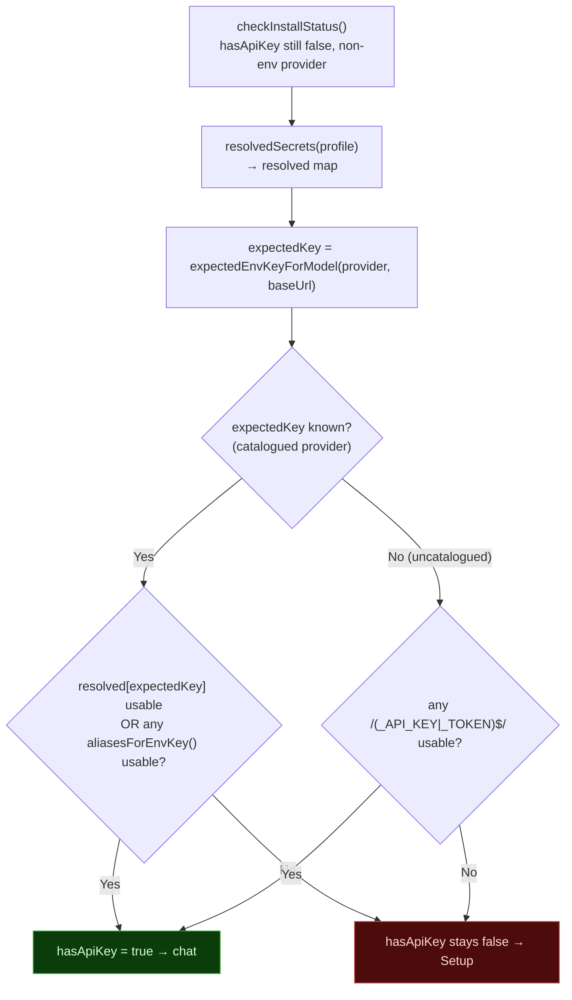
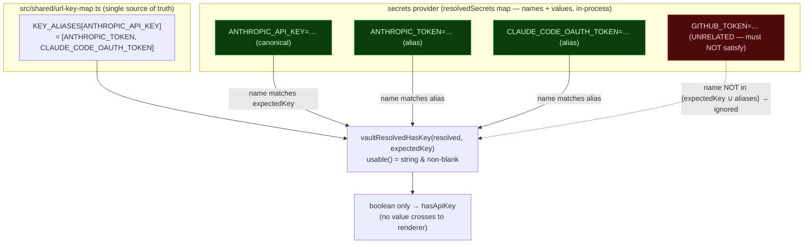

# Install gate — vault alias constraint (P1 fix) — diagrams

Diagrams for the install-gate vault-awareness fix (branch `secrets/04`, PR #673).

**The bug (Greptile P1):** when the catalogued provider's expected LLM key (e.g.
`ANTHROPIC_API_KEY`) was not resolved directly from the secrets provider, the gate
fell through to a broad `/(_API_KEY|_TOKEN)$/` scan that accepted **any**
token-shaped vault credential. A user whose vault held only `GITHUB_TOKEN` /
`SLACK_BOT_TOKEN` (and no LLM key) falsely cleared the gate and was shown the chat
screen instead of being routed back through Setup.

**The fix:** when `expectedKey` is known, accept **only** that key or one of its
accepted aliases (`aliasesForEnvKey()` over the single-source-of-truth
`KEY_ALIASES` in `src/shared/url-key-map.ts`). The broad fallback now fires **only**
when `expectedKey` is `null` (uncatalogued provider — no canonical name to match).
This brings `installer.ts` into agreement with `config-health.ts` `resolvedHasKey()`
(same alias-constrained logic). Member of the AIR-026 credential-name-alias class.

## 1. Logical flow — the install-gate vault decision

The closed hole: a vault holding only `GITHUB_TOKEN` with `expectedKey =
ANTHROPIC_API_KEY` now lands on **F (Setup)**, not **P (chat)** — the broad-scan
branch (G) is unreachable for a known provider.

## 2. SECRET / credential-name workflow — what is matched, what crosses

The "secret" here is the user's LLM credential. The gate never sees or moves the
value across a boundary — it only asks "does a usable value exist under the
expected NAME (or an accepted alias of it)?" Key NAMES are matched; the value is
read only for a non-empty/`usable()` check and never logged or returned.

## Verification

- 8/8 regression tests (`tests/installer-vault-gate.test.ts`); bug-repro reds
  against pre-fix code (broad scan returned `true` for `{GITHUB_TOKEN}`).
- Typecheck clean (node + web); semgrep TS rules clean on `installer.ts`.
- AppSec verdict: SHIP (fail-closed on resolver error; no proto-pollution/ReDoS;
  sibling-asymmetry with `config-health.ts` resolved).
