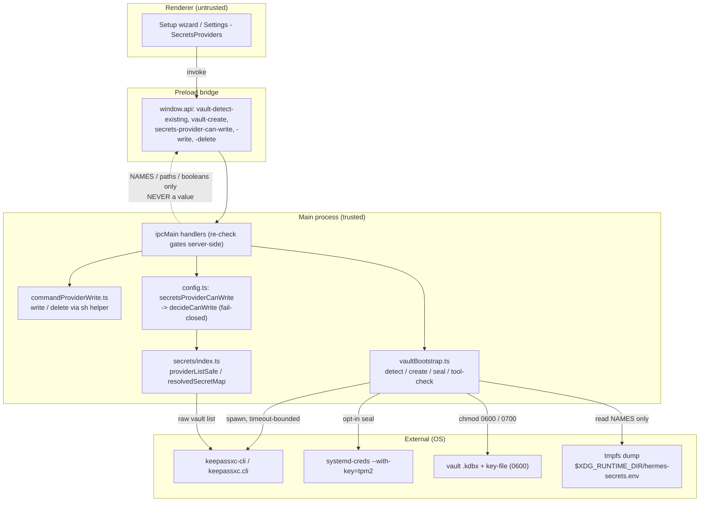
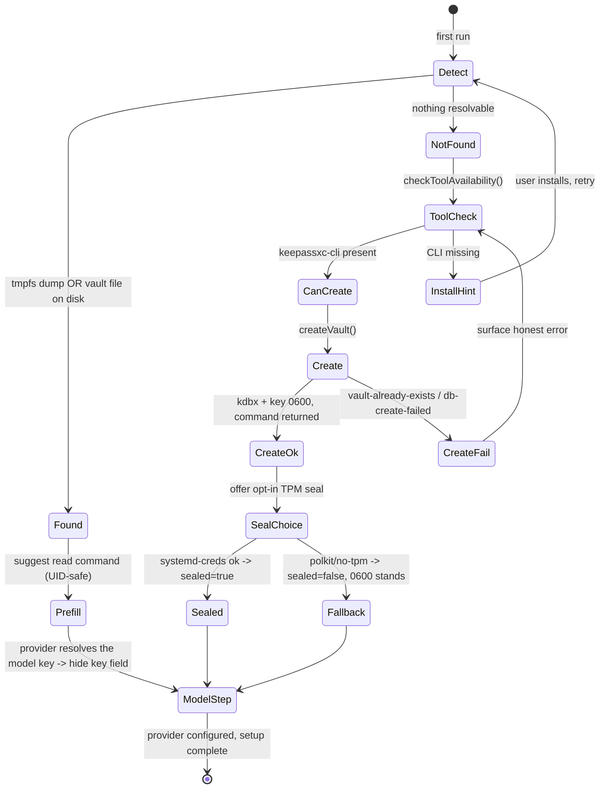
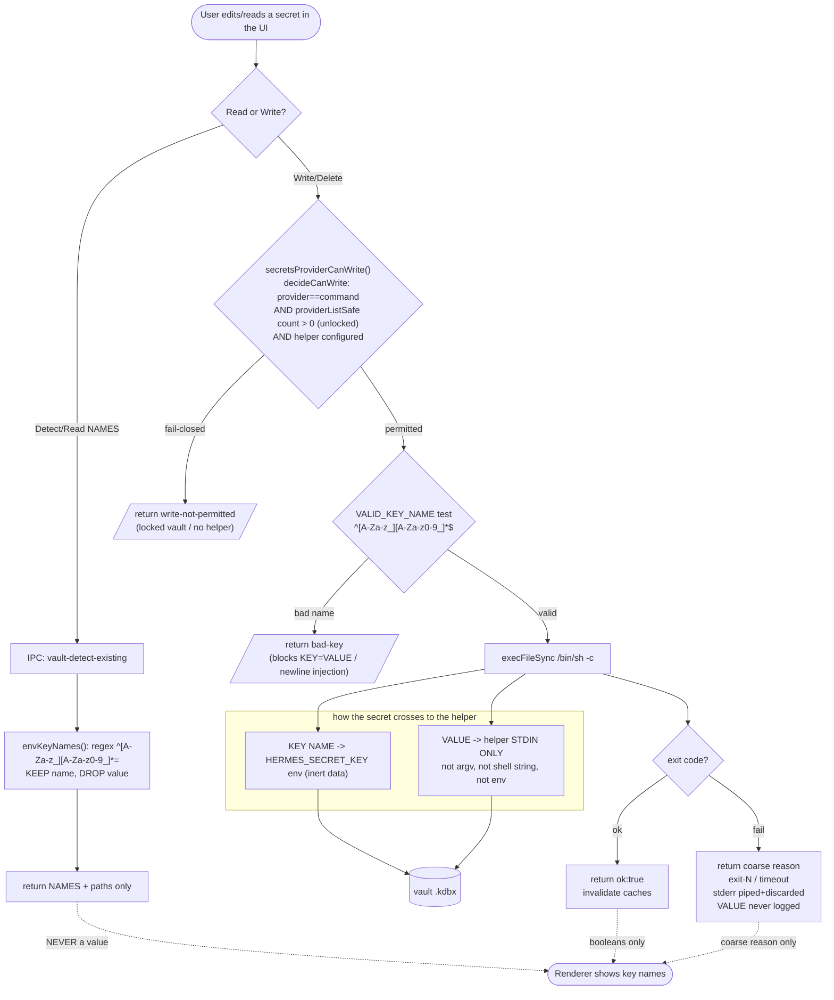

# Vault Bootstrap — Diagrams

Diagrams for the first-run vault-bootstrap / secrets-provider onboarding feature.
All three are Mermaid (render natively on GitHub) and were validated to parse via
`mermaid.parse()` before commit.

---

## 1. Logical component / data flow

How the renderer, the main-process IPC layer, the bootstrap module, and the
external tools relate. Note the trust boundary: the renderer only ever receives
NAMES / paths / booleans / counts — never a secret value.

---

## 2. First-run onboarding state machine

The "assume nothing exists" flow — every detect path has a matching create path,
and a missing dependency surfaces an install hint rather than a dead end.

---

## 3. SECRET workflow (security-critical)

How a secret VALUE and a KEY NAME move through the system, and exactly where each
is gated. This is the diagram that encodes the threat-model controls: the VALUE
never crosses to the renderer and never enters argv / the shell string / the
process env; the KEY NAME is validated before it touches a helper; writes are
fail-closed against a locked vault.

