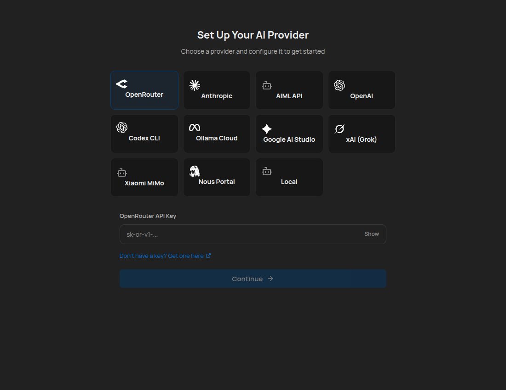
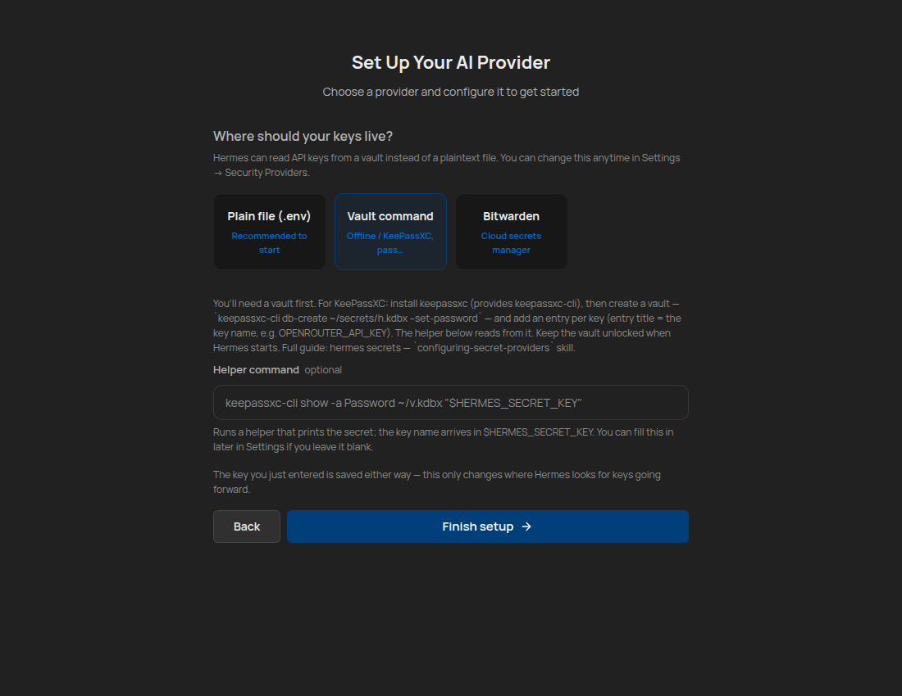
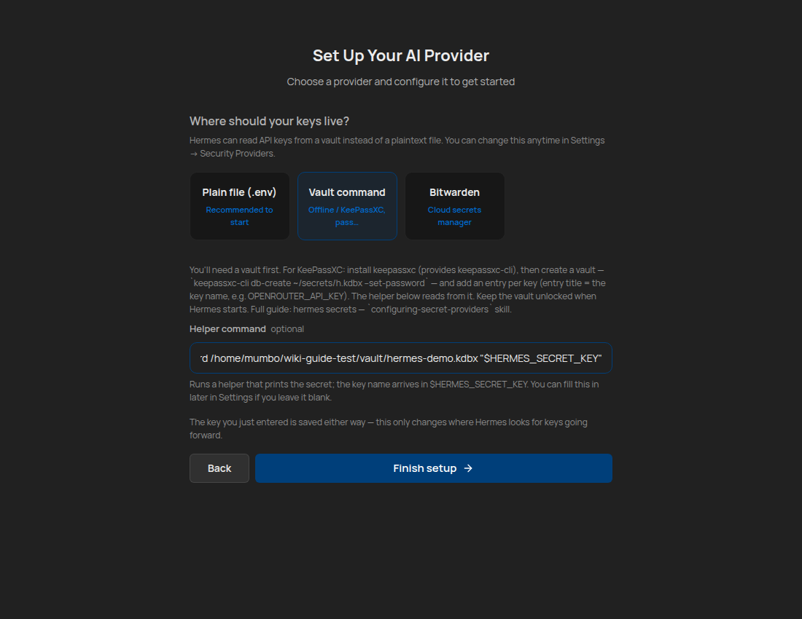

# Using a KeePassXC Vault for Your Hermes API Keys

> A step-by-step guide to keeping your API keys in an encrypted KeePassXC vault
> instead of a plaintext `.env` file — set up during first-run, or anytime from
> Settings → Security Providers.
>
> Every command and screen below was captured from a real run.

---

## Why

By default Hermes stores API keys in `~/.hermes/.env` as plaintext. With the
**command** secret provider, Hermes instead runs a small helper at startup that
reads each key from your vault. The key never has to sit in a plaintext file.

**Precedence never changes:** `process env` → `.env` → provider. A provider only
*fills in* keys that aren't already set, so turning it on can't clobber anything.

This guide uses **KeePassXC** (fully offline, no cloud). The same `command`
provider also works with `pass`, `secret-tool`, `gpg`, or any helper that prints
a secret.

---

## Part 1 — Create the vault (one-time, in a terminal)

You create the vault yourself so the master password only ever lives in your
head. Hermes can't (and shouldn't) create it for you.

### 1.1 Install KeePassXC

```sh
sudo apt install keepassxc        # Debian/Ubuntu
# or: snap install keepassxc      # snap — CLI is `keepassxc.cli`
```

This provides the `keepassxc-cli` command (snap names it `keepassxc.cli`).

> **Snap note:** snap KeePassXC can only read your home directory — keep the
> vault under a **non-hidden** home path like `~/secrets/`, never `~/.secrets/`
> or `/tmp`.

### 1.2 Create the vault

```sh
mkdir -p ~/secrets
keepassxc-cli db-create ~/secrets/hermes.kdbx --set-password
```

It prompts for a master password twice:

```
Enter password to encrypt database (optional):
Repeat password:
Successfully created new database.
```

You now have an encrypted KDBX 2.x database at `~/secrets/hermes.kdbx`
(permissions `0600` — readable only by you).

### 1.3 Add one entry per API key

**The entry title must match the environment variable name** Hermes uses for
that key (e.g. `OPENROUTER_API_KEY`, `ANTHROPIC_API_KEY`). That's how the helper
finds the right secret.

```sh
keepassxc-cli add ~/secrets/hermes.kdbx OPENROUTER_API_KEY --password-prompt
```

It asks for the vault password, then the secret value:

```
Enter password to unlock /home/you/secrets/hermes.kdbx:
Enter password for new entry:
Successfully added entry OPENROUTER_API_KEY.
```

Repeat `add` for each key you want in the vault. Confirm they're there
(names only, no values printed):

```sh
keepassxc-cli ls ~/secrets/hermes.kdbx
# → OPENROUTER_API_KEY
```

### 1.4 Verify the helper resolves a key

This is the exact command Hermes will run. `HERMES_SECRET_KEY` is the variable
Hermes sets to the key it wants; here we test it by hand:

```sh
HERMES_SECRET_KEY=OPENROUTER_API_KEY \
  keepassxc-cli show -s -a Password ~/secrets/hermes.kdbx "$HERMES_SECRET_KEY"
# (unlock prompt → stderr; the secret value → stdout)
```

If that prints your key, the vault is ready. **Keep the vault unlocked (or
unlockable non-interactively) when Hermes starts** — the helper has a 3-second
timeout and can't sit on a password prompt. For unattended/boot-time setups, see
the `keepassxc-secret-injection` approach (tmpfs + key-file/TPM) instead.

---

## Part 2 — Point Hermes at the vault (first-run setup)

When you first launch the Hermes desktop app, you'll go through setup.

### 2.1 Choose your AI provider

Pick your provider and enter its API key as usual, then click **Continue**.



(The key you enter here is saved to `.env` to get you started — the next step
lets you move future key-resolution to the vault.)

### 2.2 Choose where your keys live

After Continue, Hermes asks **"Where should your keys live?"** with three
options:

- **Plain file (.env)** — the default, recommended to start.
- **Vault command** — offline (KeePassXC, `pass`, …).
- **Bitwarden** — cloud secrets manager.


### 2.3 Select "Vault command"

Click the **Vault command** card. Hermes shows exactly what you need (the same
steps as Part 1) and a **Helper command** field:



### 2.4 Enter your helper command

In the **Helper command** field, enter the command that reads from your vault.
For the vault created in Part 1:

```
keepassxc-cli show -s -a Password ~/secrets/hermes.kdbx "$HERMES_SECRET_KEY"
```



> You can leave the helper blank and fill it in later from
> **Settings → Security Providers**.

Click **Finish setup**. Hermes saves `secrets.provider: command` plus your
helper command to `config.yaml` and refreshes its secrets cache.

---

## Part 3 — Verify it works

From a terminal:

```sh
hermes secrets status   # shows: active provider = command, key count
hermes secrets test     # runs the helper once, lists resolved KEY NAMES
                        #   (never values); non-zero exit if nothing resolves
```

Or in the desktop app: **Settings → Security Providers → Test**, which lists the
resolved key names and a count (values are never displayed).

Once you've confirmed a key resolves from the vault, you can remove it from
`~/.hermes/.env` — but only **after** `hermes secrets test` shows it resolving.

---

## Troubleshooting

| Symptom | Cause / fix |
|---|---|
| `hermes secrets test` shows 0 keys | The helper prints one bare value per call (per-key mode) — that's fine; it still resolves on demand. To *enumerate*, use a helper that prints `KEY=VALUE` lines. |
| Helper times out / startup hangs | The vault is locked and the helper is waiting on a password prompt. Keep it unlocked, or use the tmpfs/key-file approach for unattended boot. |
| "Permission denied" reading the vault (snap) | Vault is in a hidden dir or `/tmp`. Move it under `~/secrets/`. |
| A vault key seems ignored | A value already in your shell env or `.env` **wins** over the provider. Check for a stale `.env` entry. |
| Entry not found | The entry **title** must exactly equal the env var name (e.g. `OPENROUTER_API_KEY`). |
| App reverts to an older build after you quit it | Auto-update is re-downloading the public release and installing it over your locally-built/patched app on quit. Set `desktop.auto_update: false` (see below), or toggle **Settings → Automatic updates** off, then reinstall your build once. |

---

## Disabling auto-update (`desktop.auto_update`)

The desktop app ships with **automatic updates ON by default** — it checks
GitHub for a newer release and installs it on launch/quit. That is the right
default for almost everyone, and **this setting changes nothing for you unless
you opt out**.

If you run a **locally-built or patched app** (for example a vault-aware build
you compiled yourself and installed into `/opt`), the auto-updater will happily
overwrite it with the upstream release the next time you quit, and you'll lose
your changes. To stop that, disable updates:

- **In the UI:** Settings → **Automatic updates** → off. A restart applies it.
- **In `config.yaml`:**

  ```yaml
  desktop:
    auto_update: false
  ```

Only an explicit `false` (or `0`) disables it; any other value — and the
unset default — keeps auto-update enabled. The setting is read once at launch,
so **restart the app** after changing it. When disabled, the app neither checks
for nor downloads updates; you update by building/installing a new artifact
yourself.

---

## What's NOT in the vault path

The `command` provider feeds **the Hermes process only**. If you also need a
*sibling app* to read these keys, or you need the vault to unlock **unattended at
boot** (no TTY), use the tmpfs + systemd + key-file/TPM approach instead — the
`command` provider needs an already-unlocked vault and only sets env for the
process that spawned the helper.

---

*Full reference: the bundled `configuring-secret-providers` skill, and
`hermes secrets --help`.*
